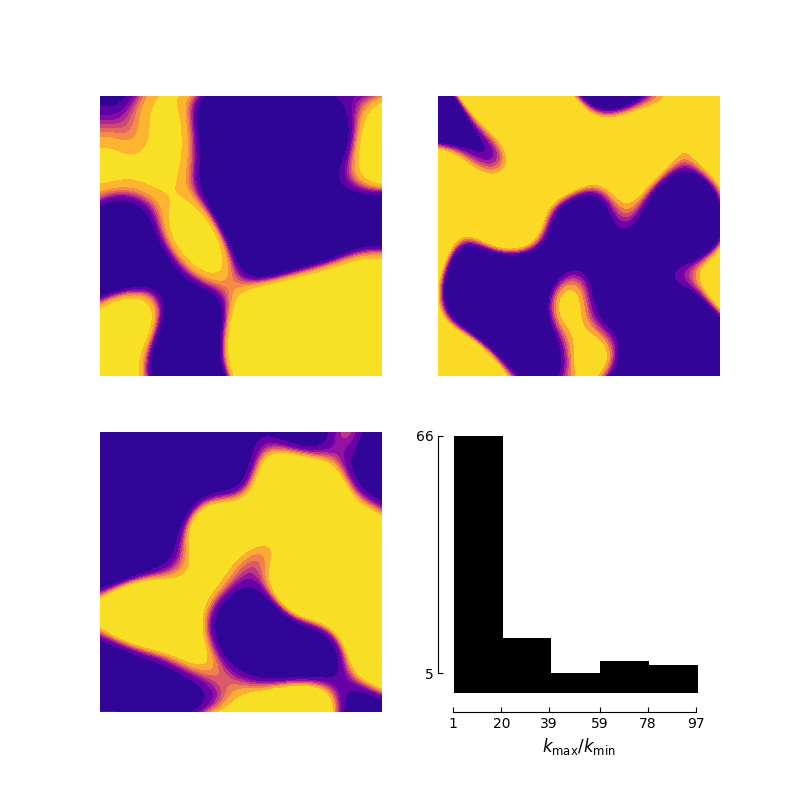
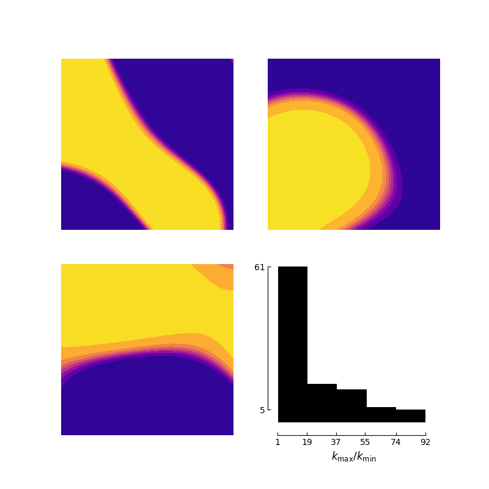
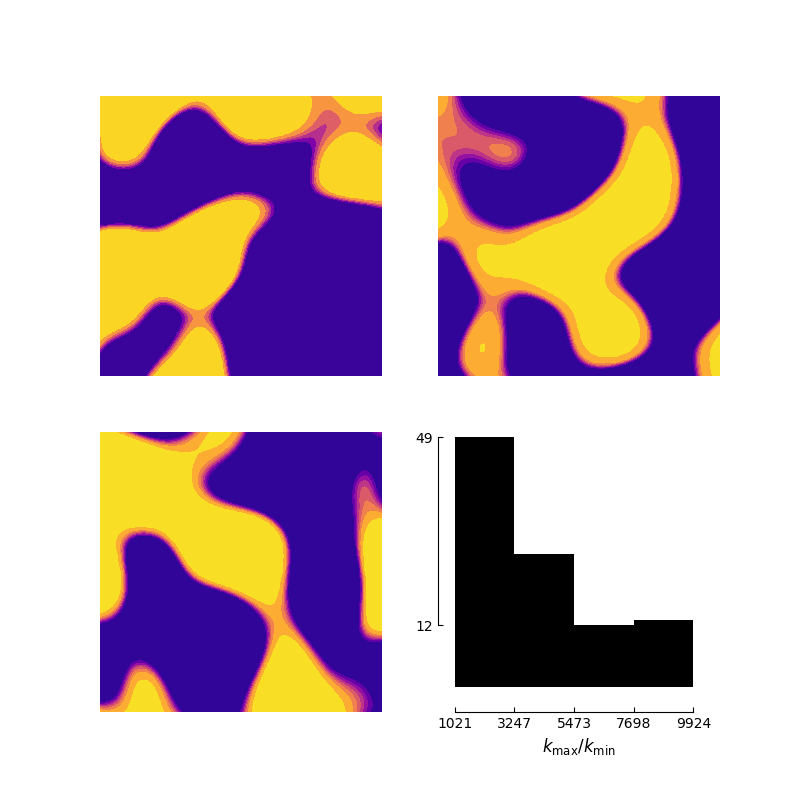
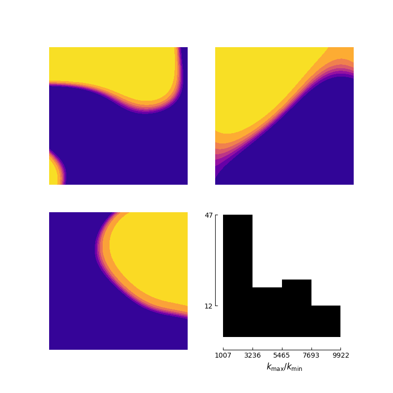
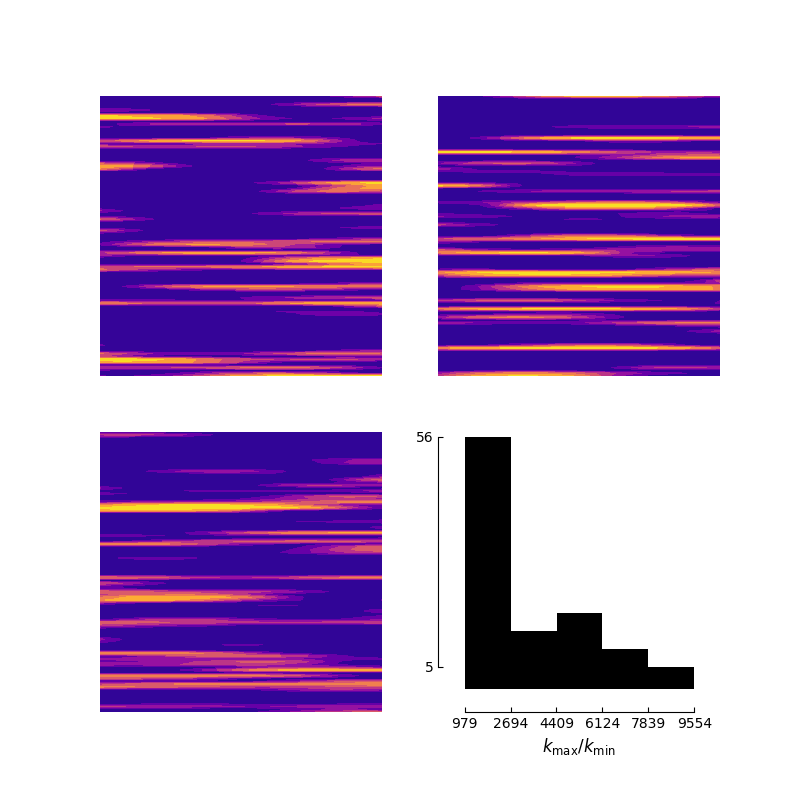
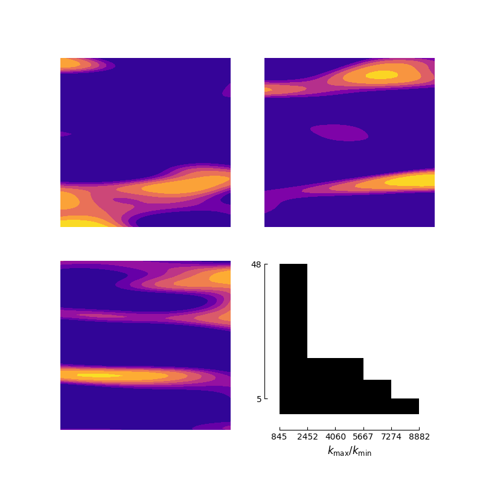
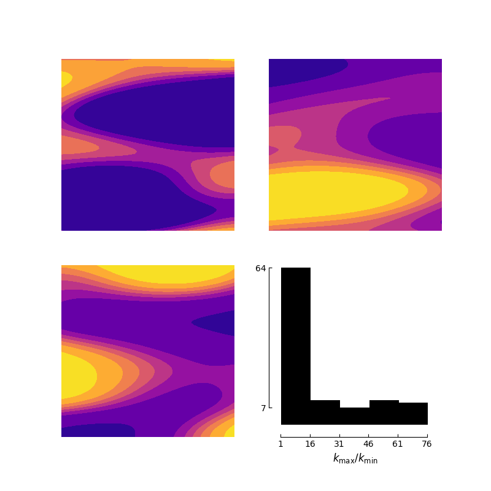
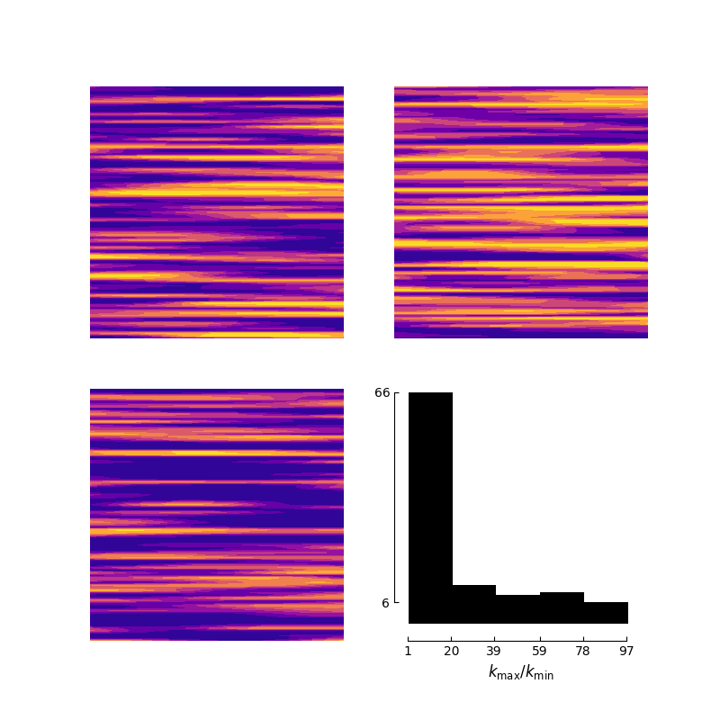

# Random conductivity fields

`conductivity_models.py` generates random, positive, spatially varying conductivity fields $k(x,y)$ on $[0,1]^2$ for the stationary diffusion problems $-\nabla\cdot(k\nabla u)=f$ discretized in [`d2_dirichlet.md`](d2_dirichlet.md) and [`d2_neumann.md`](d2_neumann.md). The construction has three steps:

1. draw a stationary **Gaussian random field** $g$ with a separable squared-exponential-type covariance (via a Karhunen–Loève-type factorization of the 1D covariance matrices);
2. **standardize** it to a field $z$ with zero mean and unit variance on the grid;
3. **squash** it with $\tanh$ and exponentiate, which gives a positive field with a controlled, bounded contrast $k_{\max}/k_{\min}$ and geometric mean $1$.

All eight models (`isotropic_1..4`, `anisotropic_1..4`) call the same function `get_conductivity_field`; they differ only in the parameters $(l_1,l_2,\beta,a,b)$.

## 1. Gaussian random field

Let $x_1,\dots,x_{N_x}$ and $y_1,\dots,y_{N_y}$ be the grid coordinates (taken from the first column and first row of the meshgrid `X`, `Y`, so the grid must be tensor-product). For a length parameter $l>0$ and exponent $p$, the 1D covariance matrix is

$$
K^{(l)}_{ij} = \exp\left(-\left(\frac{|x_i - x_j|}{l}\right)^{p}\right).
$$

All models use $p=2$, i.e. the Gaussian (squared-exponential) kernel $\exp(-r^2/l^2)$, which corresponds to the usual standard-deviation length scale $\ell = l/\sqrt 2$ and gives infinitely smooth sample paths. (For $p=1$ it would be the exponential kernel and rough paths.)

### Factorization

`kl_factor` computes the eigendecomposition $K^{(l)} = V\Lambda V^\top$ and returns

$$
W = V_{\mathrm{keep}}\Lambda_{\mathrm{keep}}^{1/2}, \qquad WW^\top \approx K^{(l)},
$$

where only eigenvalues $\lambda > 10^{-12}\lambda_{\max}$ are kept. The Gaussian kernel has very rapidly decaying spectrum, so $W$ has far fewer columns than rows, and the truncation also removes the numerically negative eigenvalues of the nearly singular matrix. With $W_1$ built from $x$ with length $l_1$ and $W_2$ built from $y$ with length $l_2$, the field is

$$
g = W_1~ C~ W_2^\top, \qquad C_{mn}\sim\mathcal N(0,\sigma^2)\ \text{i.i.d.}
$$

Writing $\mathrm{vec}$ for the row-major flattening of $g$ (consistent with the index $k(i,j)=j+iN_y$ used in the discretizations), $\mathrm{vec}(g) = (W_1\otimes W_2)~\mathrm{vec}(C)$, hence $g$ is a zero-mean Gaussian field with the **separable** covariance

$$
\mathbb E\left[g(x,y)~g(x',y')\right] = \sigma^2 \exp\left(-\frac{(x-x')^2}{l_1^2}\right)\exp\left(-\frac{(y-y')^2}{l_2^2}\right).
$$

Thus $l_1$ and $l_2$ are the correlation lengths in the $x$ and $y$ directions. If $l_1=l_2$ the field is *isotropic* (up to the separable-Gaussian form, which is in fact rotation invariant), if $l_1\neq l_2$ the field is *anisotropic*: structures are elongated along the direction with the longer length. Since $x$ is the first array axis and plotted horizontally, $l_1\gg l_2$ produces horizontal stripes/layers.

> **Note.** $\sigma$ has no effect on the final conductivity: $g$ is rescaled to unit variance in the next step. It is kept in the signature only for completeness.

## 2. Standardization

$$
z = \frac{g - \bar g}{s_g},
$$

where $\bar g$ and $s_g$ are the *empirical* mean and standard deviation of $g$ over the grid. So every sample has exactly zero grid mean and unit grid variance, independent of the sample's own randomness. (For long correlation lengths, such as $l=0.7$, a sample contains only a handful of independent "blobs", so the empirical normalization differs noticeably from the ensemble one, and $z$ is only approximately $\mathcal N(0,1)$ pointwise.)

## 3. Conductivity

A contrast parameter is drawn independently for each sample,

$$
\log_{10} C \sim \mathcal U(a,b),\qquad \ln C = \ln 10\cdot\log_{10} C ,
$$

and the conductivity is

$$
\ln \tilde k = \frac{\ln C}{2}~\tanh(\beta z),
\qquad
k = \exp\left(\ln\tilde k - \overline{\ln\tilde k}\right).
$$

Properties:

* Since $|\tanh|<1$, $\ln\tilde k\in\left(-\tfrac12\ln C,\ \tfrac12\ln C\right)$, so before the mean shift $\tilde k\in(C^{-1/2}, C^{1/2})$ and the **contrast is bounded**, $k_{\max}/k_{\min} < C = 10^{u}$, $u\sim\mathcal U(a,b)$. The bound is nearly attained when $\tanh$ saturates.
* The shift by the grid mean of $\ln \tilde k$ makes the **geometric mean of $k$ equal to $1$**, $\overline{\ln k}=0$. It does not change the contrast.
* $\beta$ controls how much $\tanh$ saturates. For $\beta=5$ almost every point has $|\beta z|\gtrsim 1$, so $k$ is nearly two-valued, $k\approx C^{\pm1/2}$ (a **binary / two-phase medium**) with thin smooth interfaces located at the zero level set of $g$. For $\beta=1$ the map is smooth and $k$ takes a continuum of values, close to the log-normal-like regime $\ln k\approx \tfrac{\ln C}{2}z$ for small $|z|$.
* $\tanh$ is odd, so $\ln k$ is symmetric in distribution about its mean: the two phases occupy comparable volume in expectation.

## Numerical generation

Given the tensor-product grid arrays `X`, `Y` (shape $N_x\times N_y$, `indexing="ij"`) and a `numpy` random generator `rng`, one sample is produced as follows.

1. **Grid coordinates.** Take $x=$ `X[:, 0]` and $y=$ `Y[0, :]`.
2. **1D covariance matrices.** Assemble the dense $N_x\times N_x$ and $N_y\times N_y$ matrices $K^{(l_1)}$ and $K^{(l_2)}$ from the formula above.
3. **Factorization.** Compute the symmetric eigendecomposition (`numpy.linalg.eigh`) of each matrix, discard eigenpairs with $\lambda\le10^{-12}\lambda_{\max}$, and form $W_1\in\mathbb R^{N_x\times r_1}$, $W_2\in\mathbb R^{N_y\times r_2}$ with $W=V\Lambda^{1/2}$. The ranks $r_1,r_2$ are much smaller than $N_x,N_y$ for large $l$ (the Gaussian kernel is numerically low-rank), and close to $N$ for $l$ comparable to the grid spacing.
4. **Random coefficients.** Draw the $r_1\times r_2$ matrix $C$ with i.i.d. $\mathcal N(0,\sigma^2)$ entries.
5. **Field.** Compute $g=W_1CW_2^\top$ with two matrix products. This samples the 2D field exactly (up to the eigenvalue truncation) without ever forming the $N_xN_y\times N_xN_y$ covariance matrix, because the covariance is a Kronecker product.
6. **Standardize** $z=(g-\bar g)/s_g$ using the mean and standard deviation over all grid points.
7. **Contrast.** Draw $u\sim\mathcal U(a,b)$ from `rng` and set $\ln C=u\ln10$.
8. **Conductivity.** Evaluate $\ln\tilde k=\tfrac12\ln C\tanh(\beta z)$, subtract its grid mean, and exponentiate.

The generator draws all randomness from the passed `rng` (the coefficients $C$ first, then $u$), so a seeded generator gives reproducible fields. The cost is dominated by the two eigendecompositions, $O(N_x^3+N_y^3)$, which are cheap for $N\approx100$.

The grid does not need to be uniform in principle, but must be a tensor product of 1D coordinate sets. In the examples the fields are sampled on $N=100$, using the Dirichlet interior grid for `isotropic_1/2` and the Neumann grid for the other models , and the contrast histograms use 100 independent samples per model.

## Parameters of the eight models

All models use $p=2$, $\sigma=1$.

| model | $l_1$ | $l_2$ | $\beta$ | $\log_{10}C\sim\mathcal U(a,b)$ | grid used for the examples |
|---|---|---|---|---|---|
| `isotropic_1` | 0.2 | 0.2 | 5 | $(0.1, 2)$ | Dirichlet |
| `isotropic_2` | 0.7 | 0.7 | 5 | $(0.1, 2)$ | Dirichlet |
| `isotropic_3` | 0.2 | 0.2 | 5 | $(3, 4)$ | Neumann |
| `isotropic_4` | 0.7 | 0.7 | 5 | $(3, 4)$ | Neumann |
| `anisotropic_1` | 0.6 | 0.01 | 1 | $(3, 4)$ | Neumann |
| `anisotropic_2` | 0.6 | 0.1 | 1 | $(3, 4)$ | Neumann |
| `anisotropic_3` | 0.8 | 0.2 | 1 | $(0.1, 2)$ | Neumann |
| `anisotropic_4` | 0.6 | 0.01 | 1 | $(0.1, 2)$ | Neumann |

The generator itself only uses the grid coordinates, so it works on either grid; the grids differ only in which points are present (interior points for Dirichlet, including the boundary for Neumann).

## Visualization

Every figure below shows three independent samples of $k$ (`contourf`, `plasma` colormap, linear color scale, one color range per panel) and, in the lower-right panel, a histogram of the contrast $k_{\max}/k_{\min}$ over 100 samples at $N=100$. Because the color scale is linear in $k$, a bright (yellow) region means "near the maximum of this sample" and dark blue "near the minimum"; for a contrast between $10^3$ and $10^4$ most of the domain looks dark, and values in the middle of the range are visible only as thin transition layers.

### Isotropic fields, moderate contrast

Parameters: $\beta=5$, $\log_{10}C\in(0.1,2)$.

Two-phase media with smooth interfaces. Shorter correlation length gives many small inclusions; longer correlation length gives only one or two large regions per sample. The contrast is distributed roughly like $10^{u}$, i.e. between $\approx1$ and $10^2$, with most samples at low contrast.

`isotropic_1`, $l=0.2$:

`isotropic_2`, $l=0.7$:

### Isotropic fields, high contrast

Parameters: $\beta=5$, $\log_{10}C\in(3,4)$.

Same geometry as above, but the two phases differ by three to four orders of magnitude (observed ratios roughly from $10^3$ to $10^4$), producing strongly ill-conditioned diffusion problems.

`isotropic_3`, $l=0.2$:

`isotropic_4`, $l=0.7$:

### Anisotropic fields

Parameters: $\beta=1$.

Here $l_1\gg l_2$, so the correlation is long in $x$ and short in $y$: fields consist of horizontal layers/channels. The smaller $l_2$, the thinner and more numerous the layers; for $l_2=0.01$, which is about the grid spacing at $N=100$, adjacent rows are nearly independent. With $\beta=1$ there is no saturation, so intermediate values of $k$ are common, and the contrast can come close to or exceed what a two-phase medium would give because the maximum and minimum are taken over many nearly independent layers.

`anisotropic_1`, $l_1=0.6$, $l_2=0.01$, $\log_{10}C\in(3,4)$:

`anisotropic_2`, $l_1=0.6$, $l_2=0.1$, $\log_{10}C\in(3,4)$:

`anisotropic_3`, $l_1=0.8$, $l_2=0.2$, $\log_{10}C\in(0.1,2)$ (smooth, few layers, moderate contrast):

`anisotropic_4`, $l_1=0.6$, $l_2=0.01$, $\log_{10}C\in(0.1,2)$:

## Remarks

* The word "anisotropic" refers to the **correlation structure** ($l_1\neq l_2$), not to a tensor-valued conductivity: $k$ is always a scalar field. The histograms' $k_{\max}/k_{\min}$ is the *contrast*.
* The sampled contrast is a random quantity: the per-sample value $C$ is random, and the realized ratio is smaller than $C$ when $\tanh$ does not saturate.
